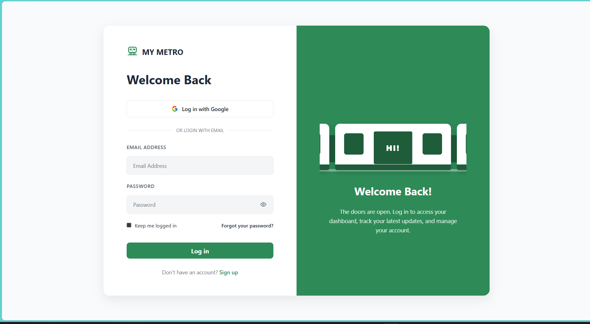
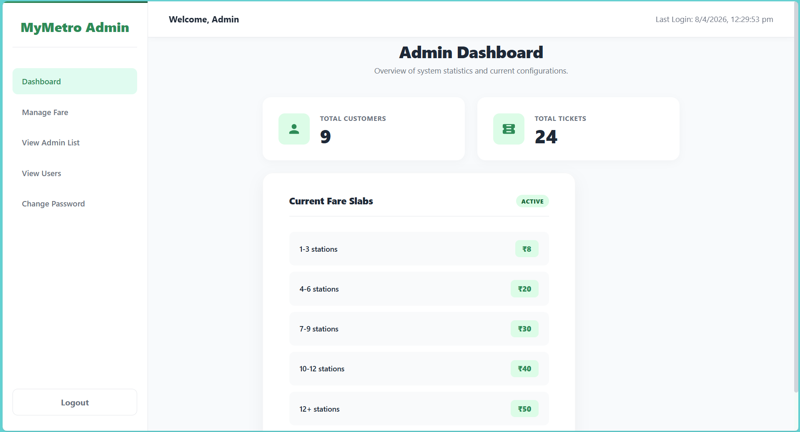
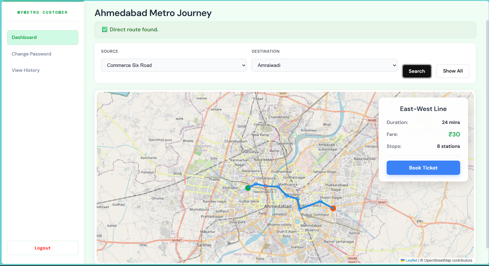
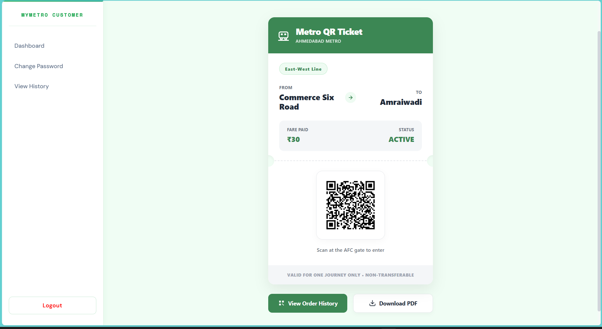
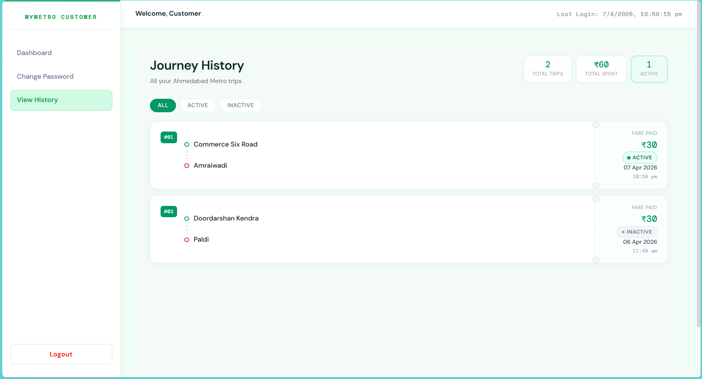

# 🚇 MyMetro – Metro Management & Ticketing System

A full-stack metro management and ticket booking platform with role-based access for customers and admins. The system enables route management, fare calculation, ticket booking, and validation similar to real-world metro systems.

---

## 📊 Requirement Analysis

### Customer Functionalities
The customer portal allows users to register and log in using email/password or Google OAuth. Users can browse stations, routes, and fares, select their source and destination, and view dynamic fare calculations. Tickets can be confirmed, paid for, downloaded in a usable format, and stored in travel history. Users can manage account settings, including password changes or recovery, and log out securely.

### Admin Functionalities
The admin portal provides secure login and authentication. Admins can manage fare pricing, monitor customer histories, add additional admin accounts, validate critical updates like fare changes, and oversee system usage and data integrity.

---

## ⚙️ System Design

### Technology Stack
The system is built using the MERN stack:
- **MongoDB** for storing application data
- **Express.js & Node.js** for backend RESTful APIs
- **React.js** for building an interactive frontend

### System Overview
The system follows a modular architecture separating customer and admin portals:

**Customer Portal:** Ticket booking, payments, and travel history management.  
**Admin Portal:** Fare management and user monitoring.  

Authentication is handled via email/password or Google OAuth.

### Ticketing and Validation
Tickets simulate real metro validation:
- Each ticket can be scanned **twice** (entry + exit)  
- Tickets are valid only for the selected route (e.g., Station 1 → Station 5 is valid for `{1, 2, 3, 4, 5}`)

This ensures secure and route-specific ticket usage.

### Database Design
The system uses a document-based schema with collections for Users, Tickets, Payments, Stations, Routes, Schedules, and Fare.  
Key relationships include:
- Tickets ↔ Users  
- Tickets ↔ Payments  
- Routes define station connectivity, distances, and schedules

### System Workflow
Users register or log in, select source and destination stations, and the system calculates the fare dynamically. After confirmation and payment, a digital ticket is generated and stored. Users can access their ticket and travel history, and tickets are validated via entry and exit scans for a secure experience.

---

## 🖼️ UI Screens

### 🔐 Login Page

### 🛠️ Admin Dashboard

### 👤 Customer Dashboard

### 🎫 Ticket View

### 📜 History Page

---

